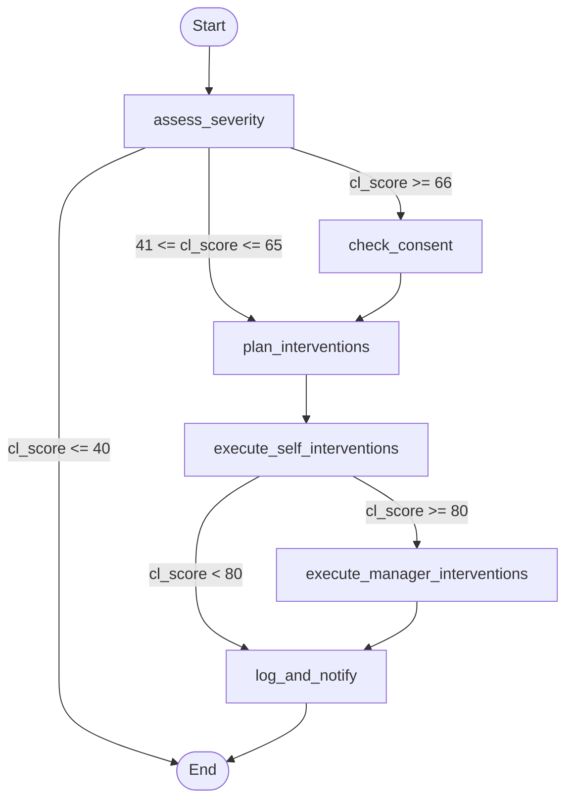

# Reference Specification: Scoring Model & LangGraph Agent

This document preserves the original design specifications, mathematical models, and agent architectures from the initial Cognitive Load Balancer (`completepath.md`) prior to removing the `/repo` directory. Use this as the official reference spec for future ports, scaling, and compliance checks.

---

## 1. Cognitive Load Scoring Engine

The scoring engine computes a composite Cognitive Load (CL) Score (0 to 100) and alert levels based on five specialized signal inputs.

### 1.1 Signal Categories & Weights

The total score is a weighted sum of five components:

| Signal Category | Weight | Primary Data Source |
| :--- | :---: | :--- |
| **Temporal** | 30% | Google Calendar (Meeting density, gaps, focus windows) |
| **Communication** | 25% | Slack (Response times, message counts, after-hours) |
| **Task Switching** | 20% | GitHub & Jira (PRs, ticket age, reassignments) |
| **Boundary** | 15% | Combined (After-hours meetings, pings, consecutive days worked) |
| **Sentiment** | 10% | Slack NLP (RoBERTa sentiment analysis tracking) |

### 1.2 Mathematical Component Logic

#### Temporal Score (0-100)
- **Meeting Count (Max 25 pts)**:
  - $\le 3$ meetings: 0 pts
  - $4-5$ meetings: 15 pts
  - $6-7$ meetings: 20 pts
  - $> 7$ meetings: 25 pts
- **Back-to-back chains (Max 25 pts)**: $+8$ pts per consecutive meeting chain with $< 15$ min gaps.
- **Average Meeting Gap (Max 20 pts)**:
  - $\ge 45$ min: 0 pts
  - $20-44$ min: 10 pts
  - $10-19$ min: 17 pts
  - $< 10$ min: 20 pts
- **Focus Blocks (Max 15 pts)**: $15 - (\text{Focus Blocks} \times 5)$ where a focus block is $\ge 2$ hours uninterrupted.
- **Days Without Break (Max 15 pts)**: $+3$ pts per consecutive day with $\ge 5$ hours of meetings.

#### Communication Score (0-100)
- **Response Latency (Max 30 pts)**:
  - $\le 15$ mins: 0 pts
  - $16-60$ mins: 10 pts
  - $61-180$ mins: 20 pts
  - $> 180$ mins: 30 pts
- **Sentiment Degradation**: $+15$ pts if 7-day sentiment trend is "DEGRADING".
- **Message Quality Degradation**: $+15$ pts if 7-day average message length trend is "DEGRADING".
- **After-Hours Messages (Max 20 pts)**: $+2$ pts per Slack message sent after 6 PM or before 9 AM.

#### Task Switching Score (0-100)
- **Parallel Open Pull Requests (Max 30 pts)**:
  - $\le 2$ open PRs: 0 pts
  - $3-4$ open PRs: 15 pts
  - $5-6$ open PRs: 25 pts
  - $> 6$ open PRs: 30 pts
- **Tasks In Progress (Max 40 pts)**:
  - $\le 2$ active tasks: 0 pts
  - $3$ active tasks: 20 pts
  - $4-5$ active tasks: 30 pts
  - $> 5$ active tasks: 40 pts
- **Ticket Reassignments (Max 30 pts)**: $+10$ pts per ticket reassigned or bounced to the user.

#### Boundary Score (0-100)
- **After-Hours Pressure (Max 40 pts)**: $(\text{Messages after-hours} + \text{Meetings after-hours} \times 2) \times 1.5$
- **Consecutive Days Worked (Max 30 pts)**: $\text{Consecutive Days Without Break} \times 6$
- **Weekend Incursions (Max 30 pts)**: $\text{Meetings on weekends/after-hours} \times 4$

#### Sentiment Score (0-100)
- **NLP Sentiment Baseline (Max 40 pts)**:
  - Sentiment $\ge 0.5$: 0 pts
  - Sentiment $0.0 \le s < 0.5$: 15 pts
  - Sentiment $-0.3 \le s < 0.0$: 30 pts
  - Sentiment $s < -0.3$: 40 pts
- **Negative Threshold Violation**: $+35$ pts if sentiment score drops below $-0.4$.

---

### 1.3 Non-linear Burnout Risk Sigmoid Formula

The burnout risk percentage is calculated using a sigmoid function centered at a CL Score of 60, compounded by historical high-stress periods and behavioral multipliers:

$$\text{Risk}_{\text{base}} = \frac{1}{1 + e^{-0.1 \cdot (\text{CL Score} - 60)}}$$

#### Burnout Multipliers
- **Sustained Load Multiplier**: $1.0 + (\text{Days with CL Score} > 70 \text{ in last 14 days}) \times 0.05$
- **Sentiment Multiplier**: $1.3$ if communication or sentiment trends are "DEGRADING".
- **After-Hours Multiplier**: $1.2$ if meetings after 6 PM exceed 2 in a week.

$$\text{Burnout Risk (\%)} = \min\left(100, \text{Risk}_{\text{base}} \times \text{Sustained Mult} \times \text{Sentiment Mult} \times \text{After-Hours Mult} \times 100\right)$$

---

## 2. Active Intervention Agent (LangGraph Architecture)

The LangGraph agent acts as a stateful node machine that coordinates responses to elevated cognitive load. 

### 2.1 Agent State Definition

```python
class InterventionState(TypedDict):
    person_id: str
    person_name: str
    cl_score: float
    alert_level: str
    risk_factors: list[str]
    recommended_interventions: list[str]
    signals: dict
    actions_taken: list
    manager_notified: bool
    person_consented: bool
```

### 2.2 Graph Topology & Routing



### 2.3 Executed Tools Matrix
1. `block_calendar_time`: Auto-adds focus blocks (Google Calendar API).
2. `decline_calendar_invite`: Auto-declines non-critical meetings that conflict with focus time.
3. `set_slack_status`: Sets emoji (e.g. `:brain:`) and focus mode text with expiration timestamp.
4. `send_slack_dm`: Sends a direct private notification to the user offering workload tips.
5. `notify_manager`: Dispatches a private, confidential DM to the manager with risk factors.
6. `reduce_sprint_scope`: Dispatches a request to the Project Manager to reduce active tickets.
7. `enable_auto_dnd`: Automatically snoozes Slack notifications after hours.
